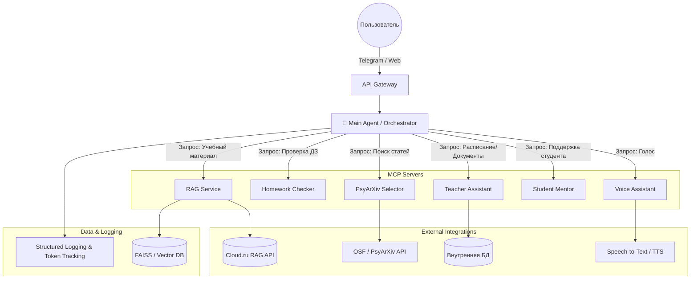
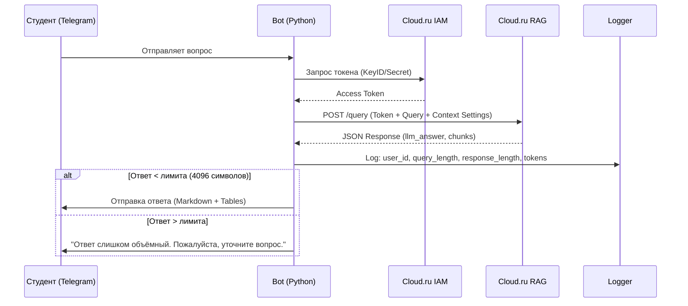
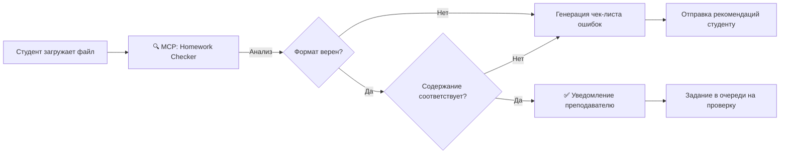
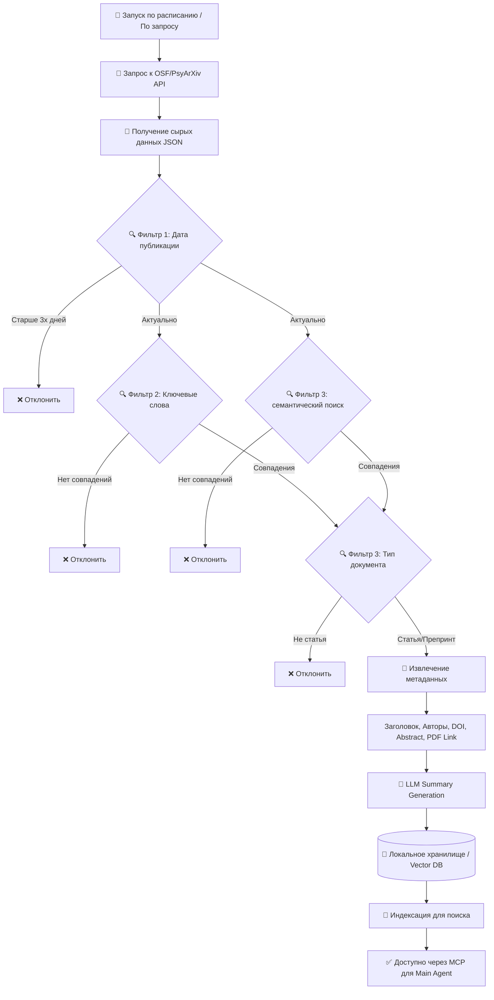
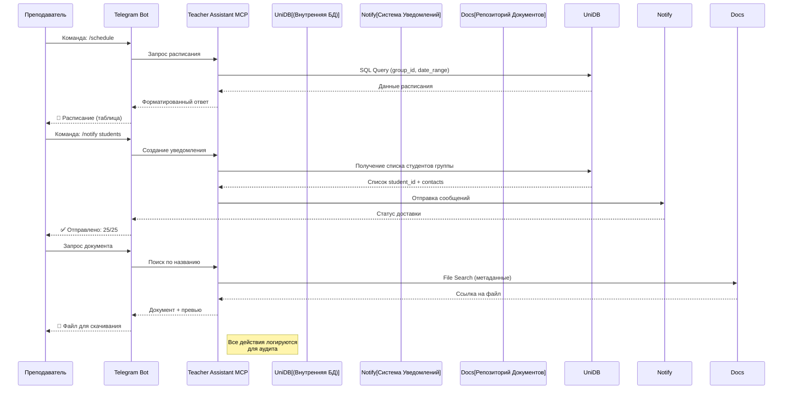
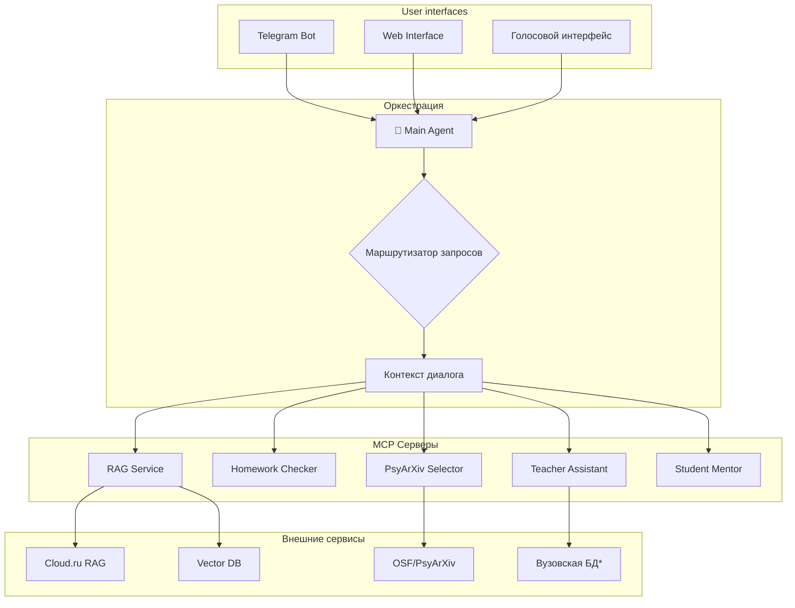

# 🎓 EduAI: Интеллектуальная образовательная экосистема 


> **EduAI** — это многокомпонентная система на базе агентов и LLM, разрабатываемая для поддержки образовательного процесса. Система объединяет инструменты для студентов (учебный ассистент, менторство), преподавателей (проверка ДЗ, ассистент, отбор литературы) и автоматизации рутины в единый интерфейс.

---

## 🏗 Архитектура Системы

Проект реализуется по архитектуре **Main Agent + MCP Servers**. Центральная модель-оркестратор распределяет задачи между специализированными модулями (MCP), каждый из которых отвечает за конкретную предметную область.



---
## 🔄 Ключевые Сценарии (Data Flow)

### 1. RAG-помощник в Telegram
Поток обработки запроса студента через облачный RAG.



### 2. Модуль первичной проверки ДЗ
Автоматическая валидация перед передачей преподавателю.



### 3. 📚 PsyArXiv Selector — Сбор и фильтрация статей
Процесс агрегации научных публикаций из открытых источников.



### 4. 👨‍🏫 Teacher Assistant — Помощник преподавателя
Работа с расписанием, документами и уведомлениями.



### 5. 🧠 Общая архитектура взаимодействия MCP-серверов
Как модули коммуницируют через Main Agent.




---

## 🧩 Модули Проекта

| Модуль | Описание | Путь | Статус |
| :--- | :--- | :--- | :--- |
| **🤖 Core Agent** | Оркестратор: маршрутизация запросов, управление контекстом, логирование | [`/src/core`](./src/core) | 🚧 В разработке |
| **📚 RAG Service** | Интеграция с Cloud.ru RAG, обработка Markdown/таблиц, лимиты токенов | [`/src/modules/rag`](./src/modules/rag) | 🚧 В разработке |
| **📝 Homework Checker** | Предварительная проверка ДЗ: оформление, объем, ключевые слова | [`/src/modules/homework`](./src/modules/homework) | 🚧 В разработке |
| **🔍 PsyArXiv Selector** | Скрипты сбора статей (OSF), фильтрация по регулярным выражениям, саммари | [`/src/modules/papers`](./src/modules/papers) | 🟡 MVP готов |
| **👨‍🏫 Teacher Assistant** | Работа с расписанием, уведомления, доступ к внутренней документации вуза | [`/src/modules/teacher`](./src/modules/teacher) | 🚧 В разработке |
| **🗣️ Voice Assistant** | STT/TTS обвязка для голосового взаимодействия на занятиях | [`/src/modules/voice`](./src/modules/voice) | 📅 Planned |
| **🎓 Student Mentor** | Долгосрочное сопровождение, трекинг прогресса, адаптивные подсказки | [`/src/modules/mentor`](./src/modules/mentor) | 📅 Planned |
| **🔌 MCP Protocol** | Базовая реализация протокола взаимодействия агента и инструментов | [`/src/mcp`](./src/mcp) | 🚧 В разработке |

> **Легенда:** 🚧 В разработке | 🟡 MVP / Прототип | ✅ Готово | 📅 Запланировано

---


## 📊 Детальное описание новых модулей

### 🔍 PsyArXiv Selector

**Назначение:** Автоматический сбор, фильтрация и суммаризация научных публикаций по психологии из открытых репозиториев.

**Ключевые функции:**
| Функция | Описание |
| :--- | :--- |
| **API Integration** | Запросы к OSF/PsyArXiv API с пагинацией |
| **Regex Filtering** | Фильтрация по ключевым словам (психология, когнитивный, терапия...) |
| **Date Filtering** | Отбор публикаций за последний год |
| **LLM Summary** | Генерация краткого содержания (abstract + key findings) |
| **Indexing** | Сохранение метаданных для быстрого поиска через RAG |

**Выходные данные:**
```json
{
  "paper_id": "osf-xxxxx",
  "title": "Название статьи",
  "authors": ["Автор 1", "Автор 2"],
  "published_date": "2026-01-15",
  "doi": "10.xxxx/xxxxx",
  "pdf_url": "https://...",
  "summary_ru": "Краткое содержание на русском",
  "keywords": ["психология", "когнитивный"],
  "indexed_at": "2026-01-20T10:00:00Z"
}
```

---

### 👨‍🏫 Teacher Assistant

**Назначение:** Автоматизация рутинных задач преподавателя: расписание, уведомления, доступ к документам.

**Ключевые функции:**
| Функция | Описание |
| :--- | :--- |
| **Schedule Query** | Получение расписания из внутренней БД вуза |
| **Bulk Notifications** | Массовая рассылка уведомлений студентам группы |
| **Document Search** | Поиск методичек, шаблонов, приказов по репозиторию |
| **Audit Logging** | Логирование всех действий для отчётности |
| **Group Management** | Работа со списками групп и студентов |

**Примеры команд в Telegram:**
```
/schedule [группа] [дата]     — Показать расписание
/notify [группа] [текст]      — Отправить уведомление
/doc [название]               — Найти документ
/students [группа]            — Список студентов
```

## 🛠 Технологический Стек

*   **Язык:** Python 3.10+
*   **LLM & RAG:** Cloud.ru Managed RAG, GigaChat / OpenAI API, LangChain
*   **Bot Framework:** `python-telegram-bot` (v20+), `asyncio`
*   **Data Processing:** Pandas, Regex, FAISS (локально для прототипов)
*   **Infrastructure:** Docker, `.env` configuration, Structured Logging
*   **Tracking:** Comet.ml (эксперименты), File-based logs (диалоги)

---


## 📄 Лицензия

MIT License.   
